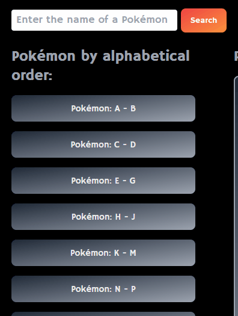
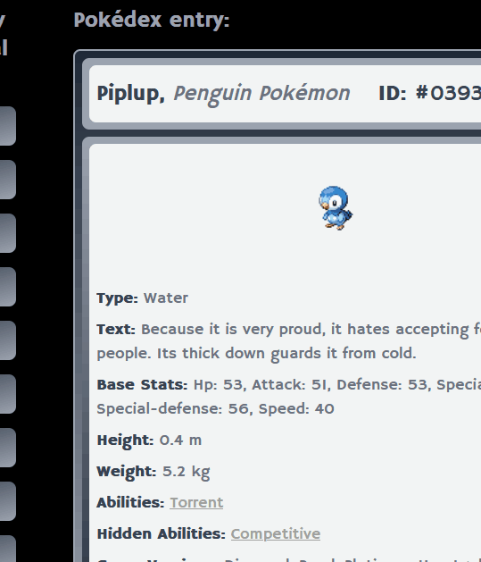

# GameLore

## Description
Pokémon GameLore is a web application designed to leverage the PokémAPI to create a responsive service for Pokémon enthusiasts.

## Features
- Search for Pokémon by name
- Browse through a list of all Pokémon
- View detailed information about a Pokémon
- View detailed information about a Pokémon's abilities
- View detailed information about a Pokémon's evolution chain
- Browse through a list of all Pokémon game generations/versions

# Links
- [Github Repo URL](https://github.com/josefalconGH/pokemon-game-lore)
- [Github Pages URL](https://josefalcongh.github.io/pokemon-game-lore)

# Medium Articles
## Tailwind CSS Modal
- [Tailwind CSS and the Tailwind Modal](https://medium.com/@jfalconMDM/tailwind-css-and-the-tailwind-modal-f7642e945134)

# GIFs
## Main Page

## Search

## Tailwind Collapsible

## Ability Modal
